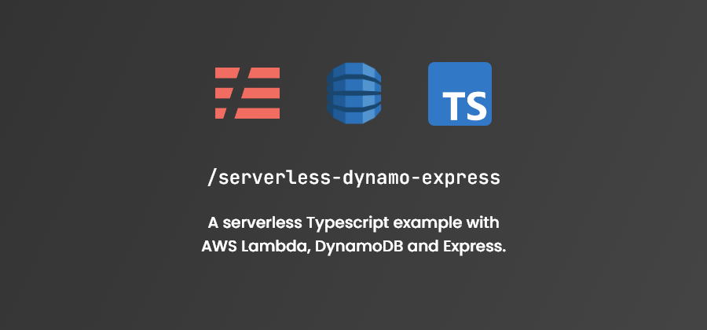

<h2 align="center">
  Serverless + DynamoDB + Express + TypeScript
</h2>

  A serverless Typescript example with AWS Lambda, DynamoDB, Express and Jest for unit testing.

## Pre-requisites

- [Pnpm](https://pnpm.js.org/)
- [Node.js](https://nodejs.org/)
- [Serverless CLI](https://serverless.com/)
- [AWS CLI (Optional)](https://aws.amazon.com/cli/)

## 🚀 How to execute

- Clone the repository
- Install the dependencies with pnpm
- Initialize the offline server with pnpm start:dev
- Now you can access the endpoints of your application at localhost:3000 of your browser.

## :memo: Licene

This project is licensed under the MIT License, so feel free to use it for any purpose.
